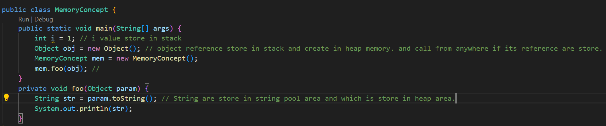
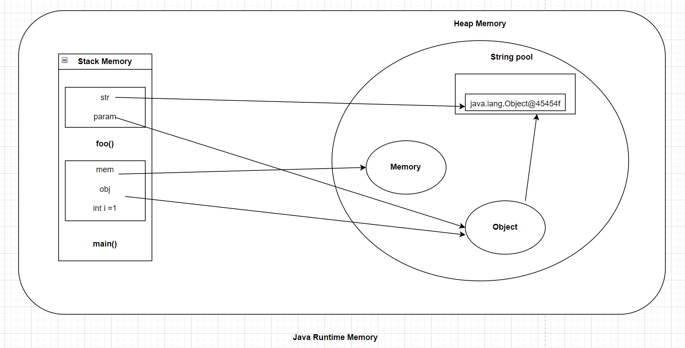

### Java Heap and Stack Memory

1. In stack data place in organised and in heap data place as un-organised  form.
2. int, byte, short, long, float, double, boolean, and char they are stored on the stack, which allows for fast access and efficient memory management.
3. If reference remove from any object then garbage collector remove its value.

