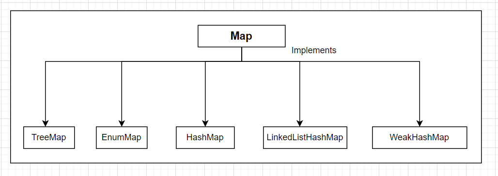

### Java Map Interface
1. In Java, elements of Map are stroed in key/value pairs. Keys are unique values assoicated with individual Values.
A map cannot contain duplicate keys. And, each key is associated with a single value.

2. Time Complexity 
    - HashMap O(1)
    - LinkedListHaspMap O(n)/O(1)
    - TreeMap O(logn)

