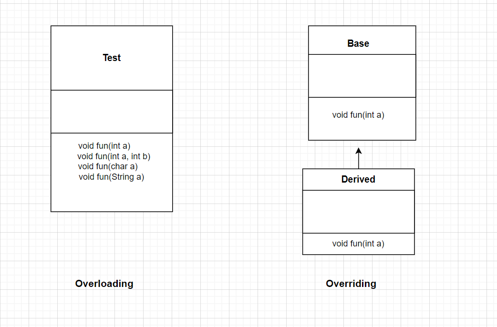

### Java Polymorphism
1. Polymorphism allows us to perform a single action in different ways. In other words, polymorphism allows you to define one interface and have multiple implementations. The word "poly" means many and  "morphs" means forms, So it means many forms. There are two types of Polymorphisms.
    - Compile-time Polymorphism (Method OverLoading)
    - Runtime Polymorphism (Method Overriding)

