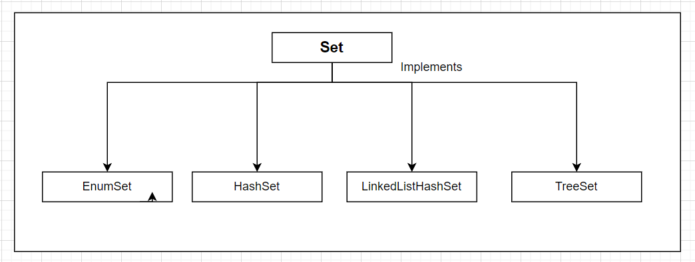

### Java Set Interface
1. The Set Interface of Java Collections framework provides the features of the mathematical set in Java. It extends the Collection interface.
2. No Duplicates: A Set cannot contain duplicate elements. If you try to add a duplicate element, the Set will ignore it.
3. Unordered Collection: The elements in a Set are not stored in any particular order. However, some implementations like LinkedHashSet maintain insertion order, and TreeSet sorts the elements.

### Java HashSet
1. In Java, HashSet is commonly used if we have to access element randomly. It is because elements in a hash table are accessed using hash codes.
2. The hashcode of an element is a unique identity that helps to identity the element in a hash table.
3. HashSet cannot contain duplicate elements. Hence, each hash set element has a unique hashcode.

### Java HashSet of Custom Objects
-   When using Set and HashSet in java, for the primitive types we can just use it without worry about how to implement the hashcode and the comparison logic. But when you want use the Set with a custom class by putting custom objects into the set, that custom class has to implement the hashCode() and equals() menthod in order for the HashSet to work.

