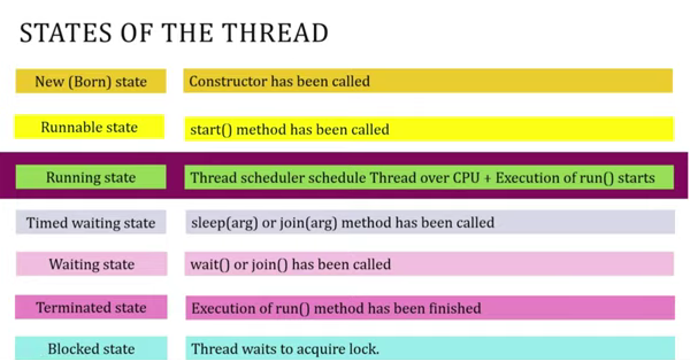

### Threads 
1. Thread is smallest execution unit of a program.
2. Multithreading is simultaneous execution of a program.

. Runnable interface is parnet interface of thread class

sleep
join

* In The above diagram Runnable and Running both are same acc. to java.